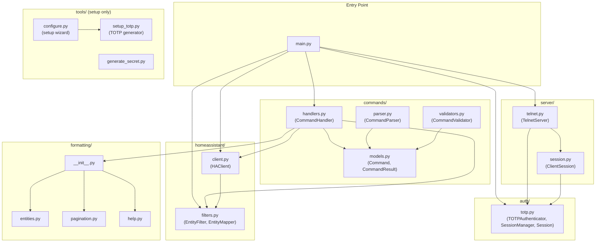
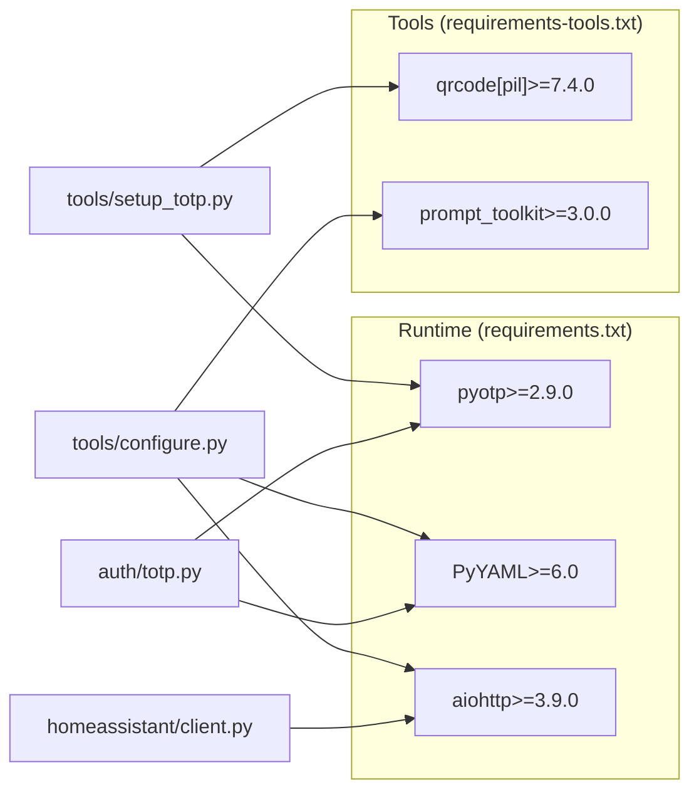

# PacketQTH Dependency Graph

## Module Dependencies

```mermaid
graph TD
    subgraph entrypoint["Entry Point"]
        main["main.py"]
    end

    subgraph auth["auth/"]
        auth_totp["totp.py<br/>(TOTPAuthenticator, SessionManager, Session)"]
    end

    subgraph server["server/"]
        server_telnet["telnet.py<br/>(TelnetServer)"]
        server_session["session.py<br/>(ClientSession)"]
    end

    subgraph commands["commands/"]
        cmd_handlers["handlers.py<br/>(CommandHandler)"]
        cmd_models["models.py<br/>(Command, CommandResult)"]
        cmd_parser["parser.py<br/>(CommandParser)"]
        cmd_validators["validators.py<br/>(CommandValidator)"]
    end

    subgraph ha["homeassistant/"]
        ha_client["client.py<br/>(HAClient)"]
        ha_filters["filters.py<br/>(EntityFilter, EntityMapper)"]
    end

    subgraph fmt["formatting/"]
        fmt_init["__init__.py"]
        fmt_entities["entities.py"]
        fmt_pagination["pagination.py"]
        fmt_help["help.py"]
    end

    subgraph tools["tools/ (setup only)"]
        configure["configure.py<br/>(setup wizard)"]
        setup_totp["setup_totp.py<br/>(TOTP generator)"]
        gen_secret["generate_secret.py"]
    end

    %% main.py deps
    main --> auth_totp
    main --> ha_client
    main --> ha_filters
    main --> cmd_handlers
    main --> server_telnet

    %% server deps
    server_telnet --> auth_totp
    server_telnet --> server_session
    server_session --> auth_totp

    %% commands deps
    cmd_handlers --> cmd_models
    cmd_handlers --> ha_client
    cmd_handlers --> ha_filters
    cmd_handlers --> fmt_init
    cmd_parser --> cmd_models
    cmd_validators --> cmd_models

    %% homeassistant deps
    ha_client --> ha_filters

    %% formatting internal
    fmt_init --> fmt_entities
    fmt_init --> fmt_pagination
    fmt_init --> fmt_help

    %% tools deps
    configure --> setup_totp
```

## External Package Dependencies

```mermaid
graph LR
    subgraph runtime["Runtime (requirements.txt)"]
        pyotp["pyotp>=2.9.0"]
        pyyaml["PyYAML>=6.0"]
        aiohttp["aiohttp>=3.9.0"]
    end

    subgraph tools_deps["Tools (requirements-tools.txt)"]
        qrcode["qrcode[pil]>=7.4.0"]
        prompt_toolkit["prompt_toolkit>=3.0.0"]
    end

    auth_totp["auth/totp.py"] --> pyotp
    auth_totp --> pyyaml
    ha_client["homeassistant/client.py"] --> aiohttp

    setup_totp["tools/setup_totp.py"] --> pyotp
    setup_totp --> qrcode
    configure["tools/configure.py"] --> aiohttp
    configure --> prompt_toolkit
    configure --> pyyaml
```
